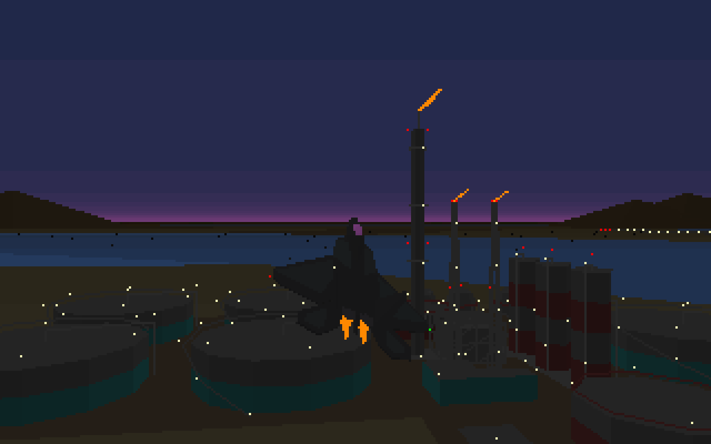
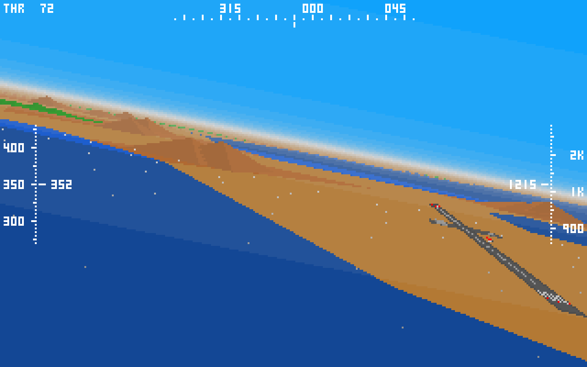
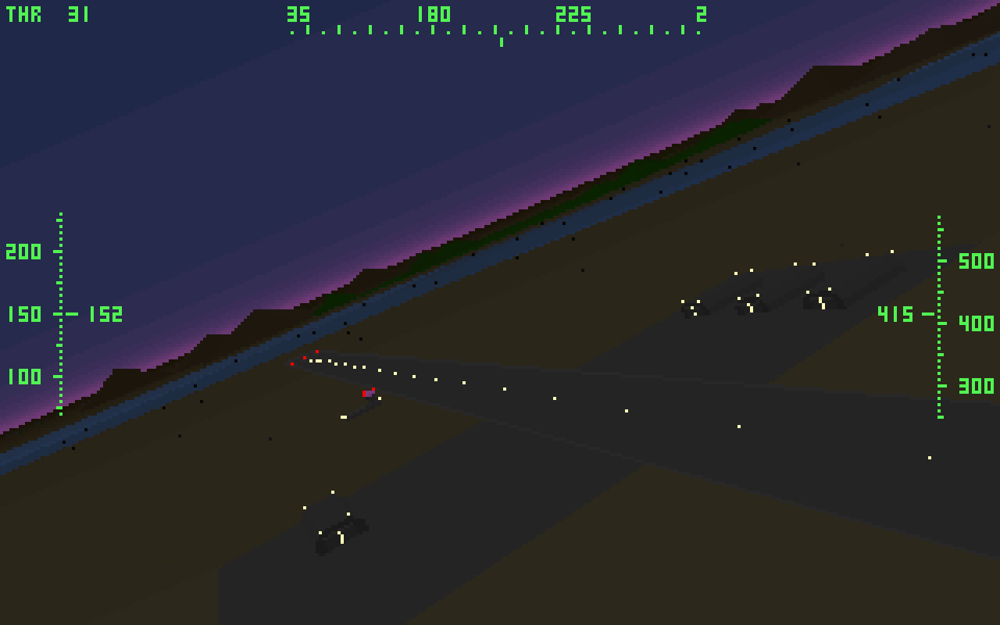
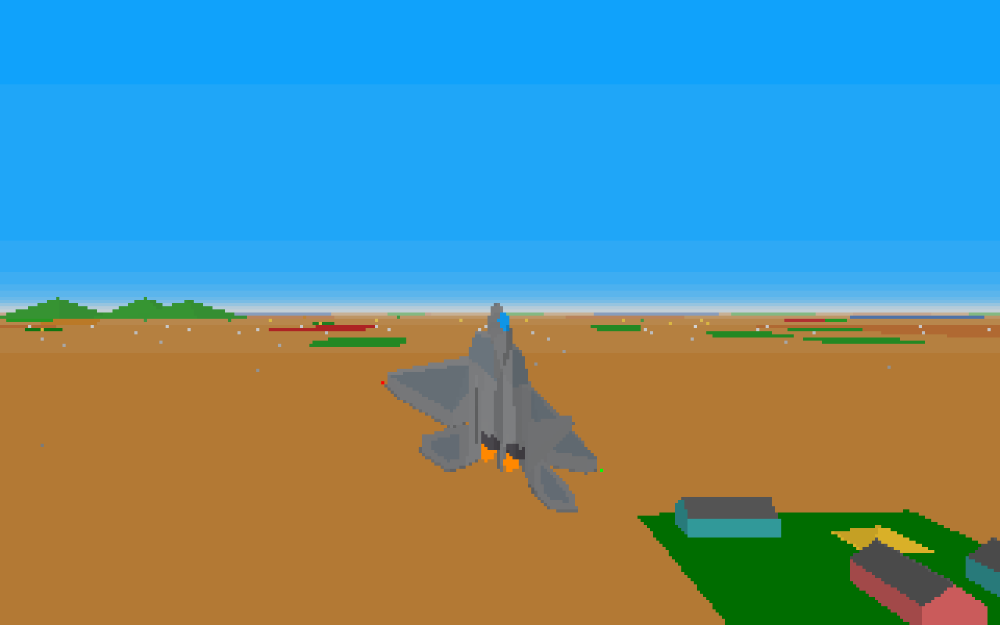

# Retro Flight Simulator

Quick and dirty attempt to replicate the visuals of late 80s / early 90s flight simulators, using as a reference MicroProse's F-117A Nighthawk Stealh Fighter 2.0 (1991).

## Live demo

[https://ruben3d.github.io/retroflightsim/dist](https://ruben3d.github.io/retroflightsim/dist)

## Screenshots

[](doc/ss08.png)
[](doc/ss07.png)
[](doc/ss05.png)
[](doc/ss09.png)

## How to build

You need node.js installed globally (I have been using 14.16.0).

```
$ cd retroflightsim
$ npm i
$ npm run build
```

## How to run

Start the local web server:

```
$ cd retroflightsim
$ npm run serve
```
Then open `localhost:8000` in your web browser (tested on Chrome/Linux).

## Instructions

Plane controls:
* `W`/`S`: Pitch.
* `A`/`D`: Roll.
* `Q`/`E`: Yaw.
* `Z`/`X`: Throttle.
* `T`: Cycle through available targets.

Views:
* `N`: Toggle Day/Night.
* `1`: Cockpit.
* `2`: Exterior behind.
* `3`: Toggle exterior left/right.

On reaching the limits of the detailed scenario the player position wraps around.
