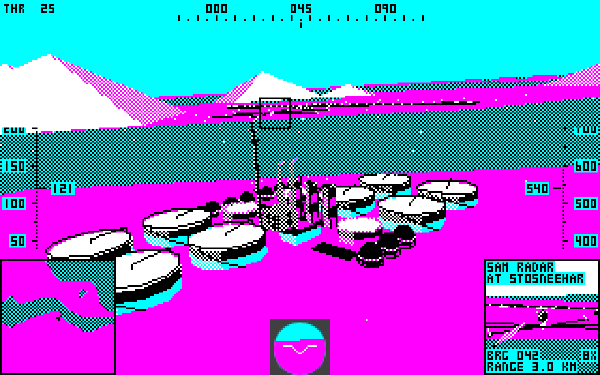
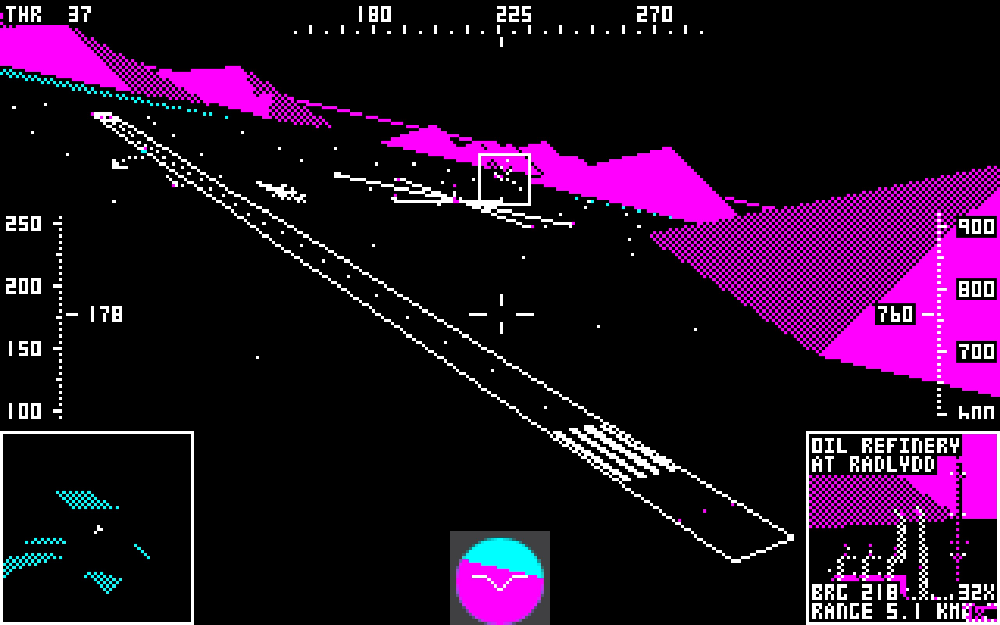
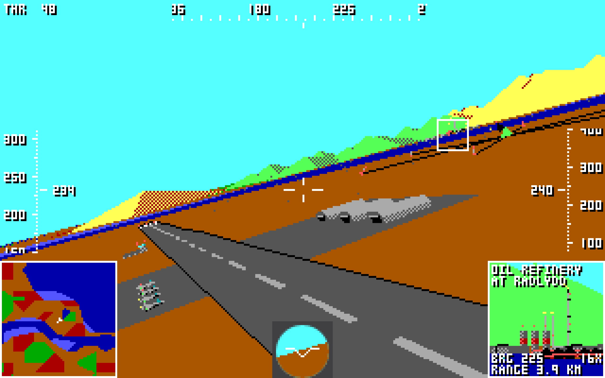
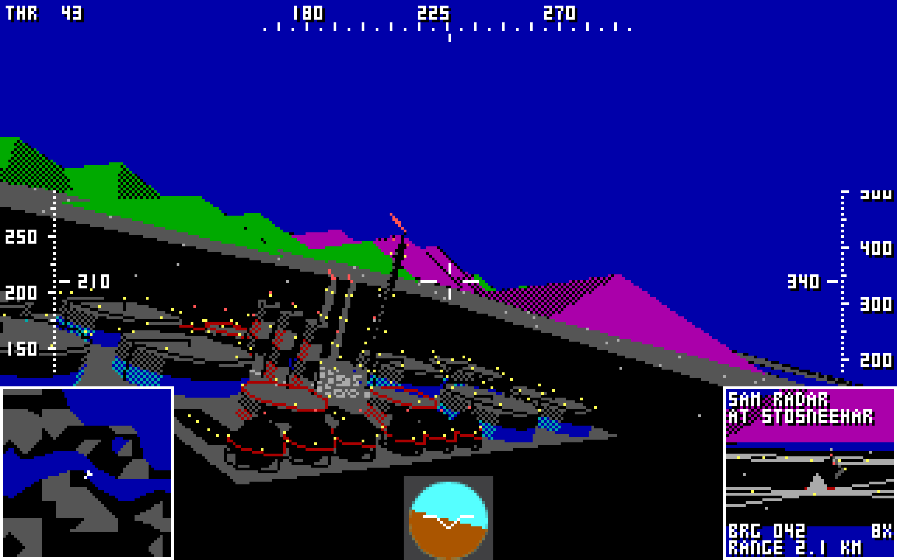
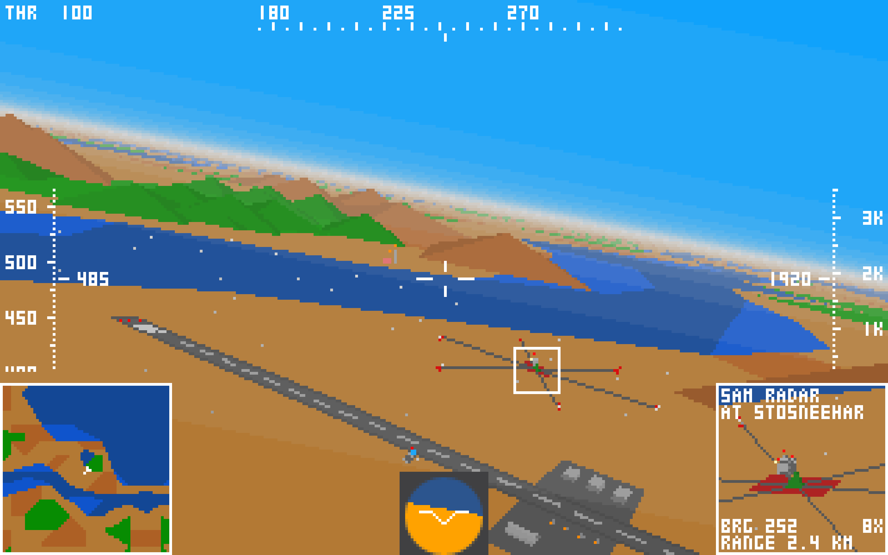
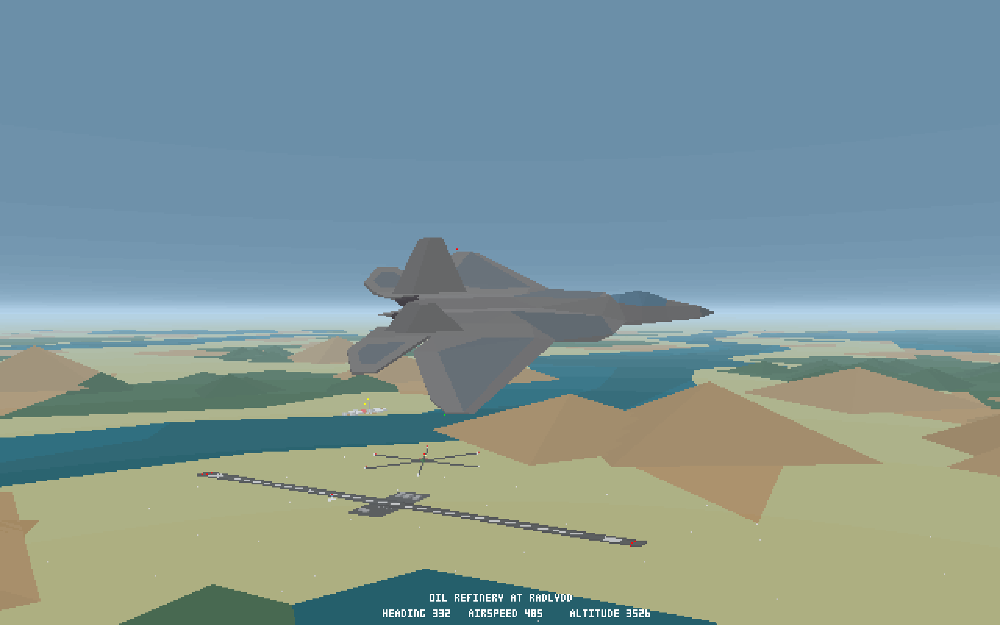
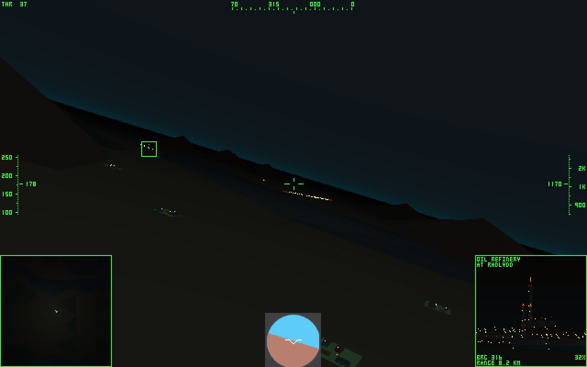

# Retro Flight Simulator

Quick and dirty attempt to replicate the visuals of late 80s / early 90s flight simulators, using as a reference MicroProse's F-117A Nighthawk Stealth Fighter 2.0 (1991).

## Live demo

[https://ruben3d.github.io/retroflightsim/dist](https://ruben3d.github.io/retroflightsim/dist)

## Screenshots

[](doc/cga-day.png)
[](doc/cga-night.png)

[](doc/ega-day.png)
[](doc/ega-night.png)

[](doc/vga-day.png)
[](doc/vga-night.png)

[](doc/svga-day.png)
[](doc/svga-night.png)

## How to build

You need node.js installed globally (I have been using 14.16.0).

```
$ cd retroflightsim
$ npm i
$ npm run build
```

## How to run

Start the local web server:

```
$ cd retroflightsim
$ npm run serve
```
Then open `localhost:8000` in your web browser (tested on Chrome/Linux).

## Instructions

### Settings

#### Generation

The generation of choice will simulate the experience of a game of that era:
* 286/CGA: mid-80s
* 286/EGA: late 80s
* 386/VGA: early 90s
* 486/SVGA: mid-90s before texture mapping 

#### Flight model

The flight model selects the realism of the simulation:
* Debug: Very simple flight model intended for debug purposes only. The plane can be stopped midair.
* Arcade: Vaguely based on realistic parameters but closer to late 80s arcade experiences.

#### Keyboard layout

Choose your keyboard layout, for users using AZERTY or Dvorak keyboards.

### Plane controls

#### Keyboard

Use the OSD settings to select the keyboard layout.

QWERTY (default):
* `W`/`S`: Pitch
* `A`/`D`: Roll
* `Q`/`E`: Yaw
* `Z`/`X`: Throttle

AZERTY:
* `Z`/`S`: Pitch
* `Q`/`D`: Roll
* `A`/`E`: Yaw
* `W`/`X`: Throttle

Dvorak:
* `,`/`O`: Pitch
* `A`/`E`: Roll
* `'`/`.`: Yaw
* `Q`/`J`: Throttle

#### Joystick

The system supports a single device connected only. If the device has less than four axes the keyboard can be used to complement the missing controls. Joystick information displayed in the OSD help.

* `Axis 1`: Pitch
* `Axis 0`: Roll
* `Axis 3`: Yaw
* `Axis 2`: Throttle

### Systems
* `G`: Landing gear
* `T`: Select target
* `I`: Toggle night (386/VGA) or IR (486/SVGA) for the tracking camera
* `F`: Cycle through HUD focus modes (disabled, partial, full)

### Views
* `N`: Toggle day/night
* `1`: Cockpit
* `2`: Toggle exterior back/front
* `3`: Toggle exterior left/right
* `4`: Toggle to/from target

On reaching the limits of the detailed scenario the player position wraps around.
